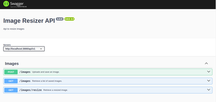

# Image Resizer API

This service offers a robust solution for image uploading and retrieval of resized images. Built on the solid foundations of Express and TypeScript, it ensures efficient performance and type-safe code.

## Tech Stack 🚀

- **Core**: Express + TypeScript
- **Unit Testing**: Jasmine + ts-mockito
- **End-to-End Testing**: Jest + supertest

## Prerequisites 📋

Ensure you have the following installed on your local machine:

- Node.js
- Npm

## Getting Started 🚦

Follow these steps to get the service up and running:

1. **Clone the repository**

```bash
git clone <repository-url>
```

2. **Install dependencies**

Navigate to the root directory of the project and execute:

```bash
npm install
```

3. **Run the service in development mode**

```bash
npm run start
```

## Testing 🧪
### Unit Tests

Execute the unit tests by running:

```bash
npm run test
```

### End to End Tests

For e2e tests, use the following command:

```bash
npm run e2e
```

## Documentation 📖

When running the service in development mode with default configurations, access the API documentation at:

http://localhost:3000/api/v1/docs

## Manual Testing 👨‍💻

## Resize an image already saved in the server

1. Once you have the server running in development mode, you can acces the Swagger documentation interface at: http://localhost:3000/api/v1/docs




