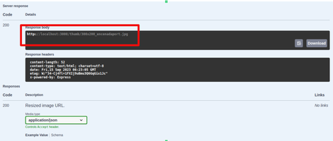

# Image Resizer API

This service offers a robust solution for image uploading and retrieval of resized images. Built on the solid foundations of Express and TypeScript, it ensures efficient performance and type-safe code.

## Tech Stack 🚀

- **Core**: Express + TypeScript
- **Unit Testing**: Jasmine + ts-mockito
- **End-to-End Testing**: Jest + supertest

## Prerequisites 📋

Ensure you have the following installed on your local machine:

- Node.js
- Npm

## Getting Started 🚦

Follow these steps to get the service up and running:

1. **Clone the repository**

```bash
git clone <repository-url>
```

2. **Install dependencies**

Navigate to the root directory of the project and execute:

```bash
npm install
```

3. **Run the service in development mode**

```bash
npm run start
```

## Testing 🧪
### Unit Tests

Execute the unit tests by running:

```bash
npm run test
```

### End to End Tests

For e2e tests, use the following command:

```bash
npm run e2e
```

## Documentation 📖

When running the service in development mode with default configurations, access the API documentation at:

http://localhost:3000/api/v1/docs

## Manual Testing 👨‍💻

### Resize an Image Already Saved on the Server

1. With the server running in development mode, navigate to the Swagger documentation interface at: http://localhost:3000/api/v1/docs


2. Select the **GET /images** endpoint and click the *Try it out* button.


3. Proceed by clicking the *Execute* button.


4. The service will display a list of all available images.


5. Navigate to the **GET /images/resize** endpoint and click on the *Try it out* button. Here, you'll find fields to input the image name (selected from the previous step) and dimensions for resizing. Note that default values are provided, but you can adjust them as needed.


6. Upon execution, the service will provide a URL. Copy and paste this into your browser to view and download the resized image.



### Resize Your Own Image

1. Select the **POST /images** endpoint and click the *Try it out* button. This will reveal an option to upload an image.


2. Once your image is uploaded, click the *Execute* button.


3. With your image now stored in the service, refer to step 2 from the previous section to proceed with resizing.
